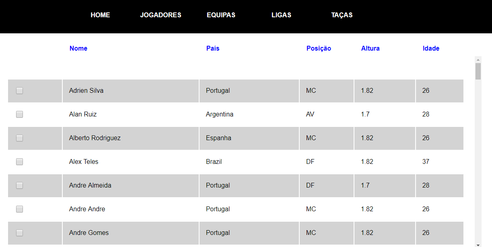
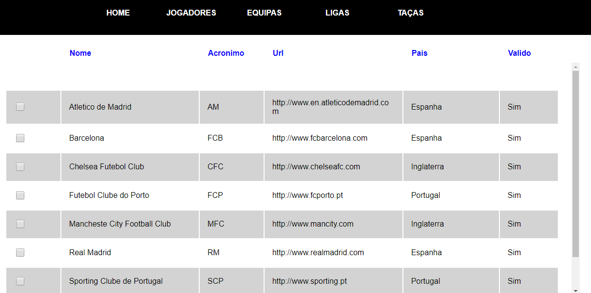

# Gestão de Futebol

### Descrição
O objetivo deste projeto é desenvolver, utilizando HTML, CSS e JavaScript, uma solução web que
permita realizar a gestão/organização de competições de futebol.
O sistema aqui proposto pretende-se que seja simples, mas ajustado à realidade e com o
objetivo que, após a sua conclusão, possa ser utilizado pelos seus executantes como uma
plataforma de organização das suas competições familiares/amigáveis ou como fonte para
manter um histórico real de competições profissionais. A decisão pela escolha de uma temática
orientada ao futebol, em detrimento de outro desporto coletivo, deveu-se principalmente à
maior facilidade de perceção dos seus conceitos pela grande maioria dos alunos,
independentemente da sua faixa etária ou cultura.bol online com html, css e javascripts

![](figura0.png

